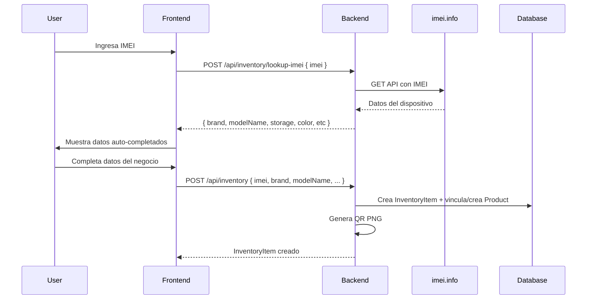

# Sistema Integral de Gestión de Inventario, Etiquetas QR y Automatización Operativa

## Objetivo General

Convertir el sistema en el centro de operación del negocio, eliminando la carga manual duplicada de información.
Cada dispositivo se carga **una sola vez** y todas las operaciones posteriores se realizan sobre ese mismo registro.

```
Llega un celular → se identifica automáticamente (IMEI)
    → se completan datos automáticos
    → el usuario completa datos faltantes
    → se guarda
    → se registra la compra automáticamente
    → se genera QR y etiqueta
    → el equipo queda en stock
    → se exhibe para la venta
    → se vende
    → se escanea el QR
    → se abre la ficha exacta del equipo
    → se confirma la venta
    → se registra la venta automáticamente
    → se actualiza el stock del catálogo online
```

## Arquitectura

### Sistema híbrido: inventario físico + catálogo online unificados

- **`Product`** (existente): representa un producto en el catálogo online, con stock numérico
- **`InventoryItem`** (nuevo): cada dispositivo físico individual, con IMEI único, código CMP-xxx, QR, trazabilidad completa

**Relación:** cuando se agrega un dispositivo por IMEI:
1. Se crea un `InventoryItem` (tracking individual)
2. Se busca un `Product` con mismo (brand + modelName + storage + color)
   - Si existe → se vincula y se incrementa su stock
   - Si no → se crea un nuevo `Product` con stock=1 y `modelGroup` = modelName

**Cuando se vende en local:**
1. Se escanea QR del InventoryItem
2. Se marca como `SOLD`
3. Se descuenta stock del `Product` vinculado
4. Se crea una `Order` (registro contable)
5. Se registra en `InventoryHistory`

**Cuando se vende online:**
- Flujo existente (Mercado Pago, checkout)
- Opcional: marcar un InventoryItem como vendido

---

## Base de Datos

### Modelo: `InventoryItem`

| Campo | Tipo | Descripción |
|-------|------|-------------|
| `id` | String (cuid) | PK |
| `code` | String (único) | CMP-001, CMP-002... auto-generado secuencial |
| `imei` | String (único) | IMEI de 15 dígitos |
| `serialNumber` | String? | Número de serie (opcional) |
| `brand` | String | Marca (auto-completado por IMEI) |
| `modelName` | String | Modelo (auto-completado) |
| `storage` | String? | Capacidad de almacenamiento |
| `color` | String? | Color |
| `modelNumber` | String? | Número de modelo (ej: A3106) |
| `deviceType` | String | celular / laptop / tablet / desktop |
| `specs` | Json? | Especificaciones técnicas completas (de API IMEI) |
| `imageUrl` | String? | Imagen de referencia |
| `purchasePrice` | Int | Precio de compra (manual) |
| `cosmeticCondition` | String | Nuevo / Impecable / Muy bueno / Bueno |
| `functionalCondition` | String? | Excelente / Buena / Con detalles |
| `batteryHealth` | Int? | 0-100 |
| `notes` | String? | Observaciones |
| `investor` | String? | Inversor |
| `targetPrice` | Int? | Precio objetivo de venta |
| `status` | InventoryStatus | IN_STOCK / IN_REPAIR / RESERVED / ON_HOLD / SOLD |
| `qrCode` | String? | QR en base64 PNG |
| `labelPrinted` | Boolean | Si ya se imprimió la etiqueta |
| `productId` | String? | FK → Product (catálogo online) |
| `supplierId` | String? | FK → Supplier |
| `purchasedFrom` | String? | Nombre de persona/local de compra |
| `purchaseDate` | DateTime | Fecha de compra |
| `salePrice` | Int? | Precio de venta final |
| `soldAt` | DateTime? | Fecha de venta |
| `soldById` | String? | FK → User (quién vendió) |
| `createdById` | String | FK → User (quién cargó) |
| `createdAt` | DateTime | |
| `updatedAt` | DateTime | |

### Modelo: `InventoryHistory`

| Campo | Tipo |
|-------|------|
| `id` | String (cuid) |
| `inventoryItemId` | FK → InventoryItem |
| `type` | String: CREATED, STATUS_CHANGE, REPAIR, SOLD, LABEL_PRINTED, NOTE |
| `oldValue` | String? |
| `newValue` | String? |
| `description` | String? |
| `userId` | String? |
| `createdAt` | DateTime |

### Enum: `InventoryStatus`

- `IN_STOCK`
- `IN_REPAIR`
- `RESERVED`
- `ON_HOLD`
- `SOLD`

### Modificaciones a `Product`

- Nuevo campo: `modelGroup` (String?) — agrupa variantes del mismo modelo (ej: "iPhone 13 Pro")
- Nueva relación: `inventoryItems InventoryItem[]`

### Modificaciones a `User`

- `createdInventoryItems InventoryItem[] @relation("CreatedBy")`
- `soldInventoryItems InventoryItem[] @relation("SoldBy")`

### Modificaciones a `Supplier`

- `inventoryItems InventoryItem[]`

---

## API Endpoints

| Endpoint | Método | Descripción |
|----------|--------|-------------|
| `/api/inventory` | `GET` | Listar inventario (filtros: status, search, imei, code, productId, page, limit) |
| `/api/inventory` | `POST` | Crear item (auto-genera código CMP, busca/crea Product, genera QR, registra history) |
| `/api/inventory/[id]` | `GET` | Item individual con history, supplier, createdBy, soldBy, product |
| `/api/inventory/[id]` | `PUT` | Actualizar item (detecta cambios, registra history) |
| `/api/inventory/[id]` | `DELETE` | Eliminar item (restaura stock del Product si corresponde) |
| `/api/inventory/[id]/sell` | `POST` | Vender: status→SOLD, descuenta stock Product, crea Order, history |
| `/api/inventory/[id]/status` | `PATCH` | Cambiar estado |
| `/api/inventory/[id]/history` | `GET` | Timeline completo del dispositivo |
| `/api/inventory/lookup-imei` | `POST` | Consulta imei.info API → devuelve datos mapeados (fallback: tabla local) |
| `/inv/[code]` | `GET` | Página Next.js: verifica auth admin → renderiza ficha del dispositivo |

---

## Frontend — Admin Panel

### Sidebar

Nuevo tab: **Inventario** (icono `qr_code_scanner`) entre "Productos" y "Accesorios".

### Vista: Lista de inventario

- Tabla con: Código, IMEI, Marca/Modelo, Color, Capacidad, Estado (badge), Batería, Precios
- Buscador por código, IMEI, marca, modelo
- Filtro por estado (Todos / En stock / Vendidos / En reparación / Reservados / En espera)
- Botón "+ Agregar dispositivo"
- Paginación

### Modal: Agregar dispositivo

**Paso 1 — Identificación automática:**
- Input IMEI (15 dígitos, solo números) + botón "Buscar"
- Alternativa: botón "Abrir cámara" (escáner de código de barras)
- Al buscar: `POST /api/inventory/lookup-imei` → consulta imei.info API
- Resultado: tarjeta verde con datos auto-completados (marca, modelo, capacidad, color, n° modelo, tipo)
- Si la API falla: campos quedan vacíos para ingreso manual

**Paso 2 — Datos del negocio:**
- Precio de compra (requerido)
- Precio target de venta
- Condición estética (Nuevo/Impecable/Muy bueno/Bueno)
- Condición funcional (Excelente/Buena/Con detalles)
- Batería (0-100%)
- Inversor
- Proveedor (select desde Suppliers existentes)
- Observaciones

**Al guardar:**
1. Genera código CMP secuencial
2. Busca Product existente con mismo (brand, modelName, storage, color)
3. Crea/vincula Product, incrementa stock
4. Genera QR PNG con `qrcode` npm package
5. Crea InventoryItem con todos los datos
6. Crea registro en InventoryHistory (type: CREATED)

### Ficha del dispositivo (`/inv/[code]`)

Página standalone protegida (solo admin autenticado):

```
┌─────────────────────────────────────────────┐
│  Great Phones  │  Inventario  │ ← Volver    │
├─────────────────────────────────────────────┤
│  CMP-042  ● En stock                        │
│  iPhone 13 Pro  256 GB Graphite             │
│  ┌──────────┐                               │
│  │   QR     │  [Descargar QR] [Imprimir]    │
│  │   PNG    │  [Vender] [Editar]            │
│  └──────────┘                               │
├─────────────────────────────────────────────┤
│  [Información] [Historial (5)]              │
├─────────────────────────────────────────────┤
│  ─── Datos del dispositivo ───              │
│  Marca: iPhone                               │
│  Modelo: iPhone 13 Pro                       │
│  IMEI: 354821093847565                       │
│  Capacidad: 256 GB                          │
│  Color: Graphite                             │
│                                             │
│  ─── Datos del negocio ───                  │
│  Precio compra: $720.000                     │
│  Precio target: $980.000                     │
│  Proveedor: iShop BA                        │
│  Condición: Impecable                        │
│  Batería: 89%                                │
│                                             │
│  ─── Timeline ───                           │
│  📦 15/01/2026  Creado por Admin            │
│  🔧 20/02/2026  Reparación: batería         │
│  💰 10/03/2026  Vendido a $950.000          │
└─────────────────────────────────────────────┘
```

### Etiqueta para impresión (4cm × 6cm)

```
┌──────────────────┐
│      [QR]        │
│                  │
│  CMP-042         │
│  iPhone 13 Pro   │
│  256 GB Graphite │
│  Batería: 89%    │
│  IMEI: 3548...   │
│  Estado: Impecable│
│  $980.000        │
└──────────────────┘
```

- CSS `@media print` con dimensiones exactas `40mm × 60mm`
- Botón "Descargar QR" (PNG)
- Botón "Imprimir etiqueta" (vista previa + window.print)

---

## Escaneo QR para venta local

**Opción A: Desde la ficha del dispositivo**
1. Botón "Vender" en la ficha
2. Modal: precio de venta, cliente (búsqueda por DNI/nombre), forma de pago, observaciones
3. Confirmar → `POST /api/inventory/[id]/sell` → status SOLD, descuenta stock, crea Order

**Opción B: Desde el POS existente (Venta en Tienda)**
1. Modificar `instore.js` para soportar escaneo QR de InventoryItem
2. Input + botón "Escanear QR"
3. Busca InventoryItem por código, agrega a lista de venta
4. Al confirmar → `POST /api/inventory/[id]/sell`

**Opción C: Escáner desde celular**
- Página mobile-friendly `/scan` con cámara activa
- Al detectar QR → redirige a `/inv/[code]` (ficha)
- Desde la ficha: botón "Vender" grande

---

## Tienda online — Agrupación por modelo (FASE 5)

### Shop listing
- Productos agrupados por `modelGroup`
- Cada modelo aparece una sola vez en la grilla
- Muestra precio desde, cantidad de variantes disponibles

### Product detail
- Selector de color/capacidad según variantes disponibles (InventoryItems IN_STOCK)
- Al seleccionar variante: cambia precio, imagen, stock
- Stock = count de InventoryItems IN_STOCK vinculados al Product + variantes del mismo modelGroup

---

## Flujo de IMEI API



---

## Cronograma de Implementación

| Fase | Descripción | Estado |
|------|-------------|--------|
| **1** | Migración DB (modelos + enums) | ✅ Completado |
| **2** | API endpoints (CRUD, lookup-imei, sell, QR, history) | ✅ Completado |
| **3a** | Admin sidebar + lista inventario | ✅ Completado |
| **3b** | Modal "Agregar dispositivo" con IMEI lookup | ✅ Completado |
| **3c** | Ficha del dispositivo `/inv/[code]` | ✅ Completado |
| **3d** | Botones Vender/Editar en ficha | ⏳ Pendiente |
| **3e** | Etiqueta 4x6cm + descarga QR | ⏳ Pendiente |
| **4** | Escaneo QR integrado en POS (instore.js) | ⏳ Pendiente |
| **5** | Tienda online con agrupación por modelo | ⏳ Pendiente |
| **6** | Escáner de cámara mobile | ⏳ Pendiente |

---

## Archivos modificados/creados

### Nuevos
- `prisma/schema.prisma` — modelos InventoryItem, InventoryHistory + enum
- `src/lib/auth.ts` — shared auth config (extraído de NextAuth route)
- `src/app/api/inventory/route.ts` — CRUD list/create
- `src/app/api/inventory/[id]/route.ts` — CRUD single item
- `src/app/api/inventory/[id]/sell/route.ts` — sell endpoint
- `src/app/api/inventory/[id]/history/route.ts` — history endpoint
- `src/app/api/inventory/lookup-imei/route.ts` — IMEI lookup
- `src/app/inv/[code]/page.tsx` — device ficha page (server)
- `src/app/inv/[code]/InventoryFichaClient.tsx` — device ficha component
- `public/lib/inventory-admin.js` — admin UI functions
- `src/lib/validations.ts` — Zod schemas para inventory

### Modificados
- `prisma/schema.prisma` — Product (modelGroup, inventoryItems), User, Supplier
- `src/app/api/auth/[...nextauth]/route.ts` — usa auth.ts compartido
- `public/index.html` — sidebar "Inventario", script inventory-admin.js
- `public/lib/admin.js` — renderAdminContent case 'inventory'
